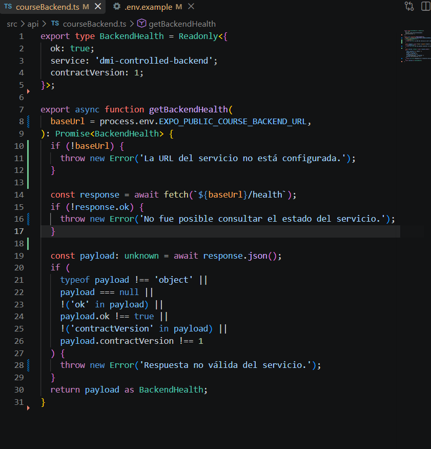
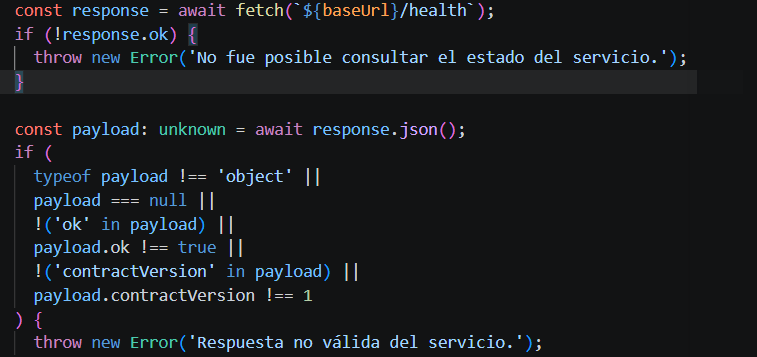
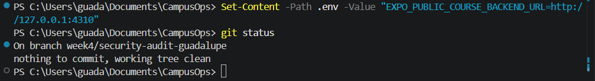

# Auditoría de Seguridad y Privacidad - Semana 4

## Hallazgos

| # Hallazgo | Riesgo | Solución aplicada | Evidencia |
|---|---|---|---|
| 1 | URL de backend escrita directamente en el código como valor por defecto | Exposición de endpoints internos o acoplamiento de infraestructura en el código fuente | Se eliminó el valor hardcoded y se configuró mediante variable de entorno `EXPO_PUBLIC_COURSE_BACKEND_URL` | `docs/evidence/env-variable.png` |
| 2 | Exposición de detalles técnicos internos y estado HTTP en mensajes de error | Revelación de arquitectura e información sensible a potenciales atacantes a través de excepciones descontroladas | Se sanitizaron las excepciones sustituyéndolas por mensajes genéricos seguros | `docs/evidence/error-messages.png` |
| 3 | Riesgo de fuga de credenciales si el archivo `.env` llega a versionarse en Git | Filtración accidental de llaves API, tokens o configuraciones privadas en el repositorio | Se verificó y validó la regla `.env` dentro de `.gitignore` | `docs/evidence/gitignore-env.png` |

---

## Detalle de Hallazgos y Correcciones

### Hallazgo 1: URL de servicio escrita directamente en código

#### Problema encontrado
El archivo `src/api/courseBackend.ts` contenía una constante `DEFAULT_URL = 'http://127.0.0.1:4310'` asignada directamente dentro de la firma de la función `getBackendHealth`.

#### Riesgo
Tener URLs o credenciales hardcoded en el código dificulta la rotación de ambientes y expone configuraciones internas.

#### Solución
Se eliminó la constante con la dirección fija, obligando a la aplicación a leer la configuración desde la variable de entorno `process.env.EXPO_PUBLIC_COURSE_BACKEND_URL`.

#### Evidencia

---

### Hallazgo 2: Información técnica sensible en mensajes de error

#### Problema encontrado
El módulo de comunicación con el backend lanzaba excepciones concatenando valores dinámicos del servidor como `${response.status}`.

#### Riesgo
Los mensajes de error detallados pueden revelar estados de respuesta internos del backend que un atacante podría aprovechar.

#### Solución
Se reemplazaron las cadenas que exponían estados o respuestas internas por mensajes sanitizados orientados a la experiencia del usuario final.

#### Evidencia

---

### Hallazgo 3: Verificación de exclusión del archivo `.env` en versión de control

#### Problema encontrado
Necesidad de garantizar que ningún entorno local con variables reales suba el archivo `.env` al repositorio público.

#### Solución
Se auditó la existencia de la regla `.env` en `.gitignore` y se verificó con `git status` que la inclusión de un archivo local `.env` fuera ignorada de forma efectiva.

#### Evidencia
